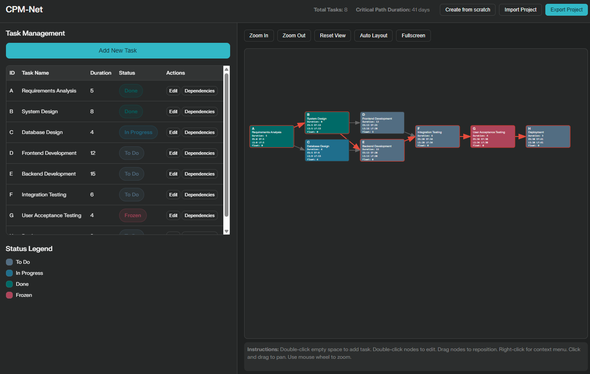

# CPM-Net

A modern, client-side web application for project scheduling and visualization using the Critical Path Method (CPM).

  

## Features

- **Task Management:** Create, edit, and organize tasks with custom IDs, names, assignees, durations, statuses, and comments.
- **Dependency Management:** Define and visualize dependencies between tasks.
- **Critical Path Visualization:** Automatically calculates and highlights the critical path in the project diagram.
- **Interactive Diagram:** Drag-and-drop task nodes, zoom, pan, and edit tasks directly from the diagram.
- **Fullscreen Mode:** View the project diagram in fullscreen for better visibility.
- **Local File Handling:** Work directly with project files on your device. Export and import projects as JSON files.
- **Privacy-Focused:** No data is collected or sent to any server—all processing happens in your browser.
- **Responsive Design:** Works well on both desktop and tablet devices.

## Usage

1. **Add Tasks:** Double-click on an empty area of the diagram to add a new task.
2. **Edit Tasks:** Double-click on a task node or use the task table to edit task details.
3. **Manage Dependencies:** Define dependencies between tasks using the dependency manager or by dragging connections.
4. **Visualize Critical Path:** The critical path is automatically calculated and highlighted in red.
5. **Export/Import Projects:** Use the file menu to manage project files.
6. **Fullscreen Mode:** Click the "Fullscreen" button to view the diagram in fullscreen.

## Contributing

Pull requests and issues are welcome!  
If you have any suggestions or bug reports, please open an issue or submit a pull request.

## License

This project is open source and available under the [MIT License](LICENSE).
